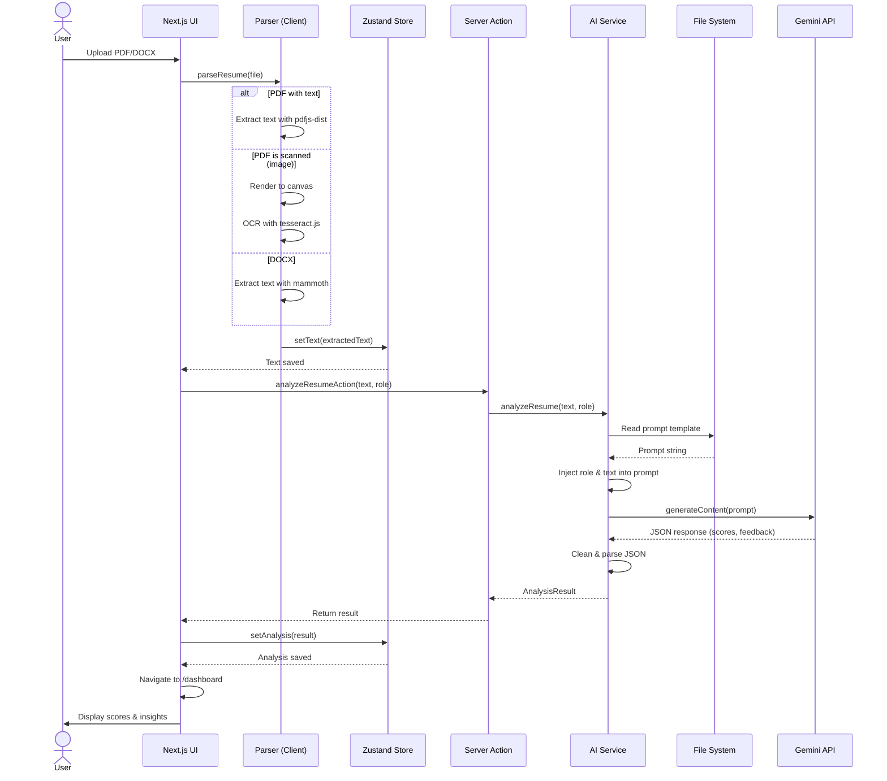

# System Architecture

## 1. High-Level Design (HLD)

The Resume AI Platform is designed as a **Hybrid Client-Server Application**. It leverages the processing power of the client device for heavy file operations (parsing/OCR) while using the server as a secure gateway for AI inference.

### System Context Diagram

```mermaid
graph TB
    subgraph "Client Layer (Browser)"
        User[User]
        UI[Next.js UI Components]
        Parser[Resume Parser Engine]
        Store[Zustand State Manager]
    end

    subgraph "Server Layer (Next.js Edge/Node)"
        Action[Server Actions Gateway]
        Service[AI Service Layer]
        PromptDB[Prompt Templates (File System)]
    end

    subgraph "External Services"
        Gemini[Google Gemini 2.0 API]
    end

    User -->|Interacts| UI
    UI -->|Uploads File| Parser
    Parser -->|Extracts Text| Store
    UI -->|Requests Analysis| Action
    Action -->|Delegates| Service
    Service -->|Reads| PromptDB
    Service -->|Inference Request| Gemini
    Gemini -->|Analysis Results| Service
    Service -->|Structured Data| Action
    Action -->|Updates| Store
    Store -->|Renders| UI
```

### Data Flow
1.  **Input**: User uploads a PDF/DOCX.
2.  **Processing (Client)**: The browser extracts text using WebAssembly-based libraries (`pdfjs`, `mammoth`). This ensures the raw file never leaves the user's device.
3.  **Transport**: Only the *extracted text* is sent to the server via a secure Server Action.
4.  **Intelligence (Server)**: The server constructs a prompt using stored templates and sends it to Gemini 2.0.
5.  **Output**: Structured JSON data is returned to the client for visualization.

---

## 2. Architectural Decisions & Rationale

We chose this specific architecture to balance **Privacy**, **Performance**, and **Simplicity**.

### A. Hybrid Processing (Client-Side Parsing)
**Decision**: Parse resume files (PDF/DOCX) in the browser instead of uploading them to a server.
-   **Why we chose it**:
    -   **Privacy First**: Resumes contain sensitive PII (Phone, Email, Address). By parsing locally, we ensure the raw file is never stored on our servers, reducing data liability.
    -   **Cost Efficiency**: We avoid the storage costs (S3/Blob) and bandwidth costs associated with handling large file uploads.
    -   **Scalability**: The compute load for parsing (which can be heavy for OCR) is distributed to the user's device, not our server.

### B. Next.js App Router & Server Actions
**Decision**: Use Next.js 14 with Server Actions instead of a separate Backend API (Express/Python).
-   **Why we chose it**:
    -   **Unified Codebase**: Frontend and Backend logic live in the same repository, sharing types and utilities. This speeds up development.
    -   **Type Safety**: We can share TypeScript interfaces (`src/types/resume.ts`) directly between the UI and the Server Action, preventing data contract errors.
    -   **Security**: Server Actions automatically handle the secure transmission of data. API keys (`GEMINI_API_KEY`) are kept strictly on the server environment.

### C. Stateless AI Interaction
**Decision**: The server does not maintain a conversation history or session database for the AI analysis.
-   **Why we chose it**:
    -   **Simplicity**: Resume analysis is a "one-shot" task. We don't need complex conversation management.
    -   **Performance**: "Flash" models like Gemini 2.0 are fast enough to re-analyze if needed, avoiding the complexity of caching stale results.

### D. File-Based Prompt Management
**Decision**: Store AI prompts as `.txt` files in `src/prompts/` rather than hardcoding strings or using a database.
-   **Why we chose it**:
    -   **Separation of Concerns**: Engineers can tweak the prompt logic (text files) without touching the application code (TypeScript).
    -   **Version Control**: Prompts are versioned alongside the code in Git, making it easy to track changes and roll back if prompt engineering degrades performance.

### E. Vercel for Deployment
**Decision**: Deploy the application on Vercel rather than traditional VPS (AWS EC2) or containerized platforms (Kubernetes).
-   **Why we chose it**:
    -   **Zero-Config Deployments**: Vercel is built by the creators of Next.js. It automatically detects build settings, environment variables, and optimizes the build for Edge deployment.
    -   **Edge Network**: Vercel deploys our app to a global CDN with 100+ edge locations, ensuring low-latency responses for users worldwide.
    -   **Serverless by Default**: We don't need to manage servers or scale infrastructure. Vercel auto-scales based on traffic.
    -   **Instant Rollbacks**: Every deployment is immutable and versioned, making rollbacks one-click in case of issues.
    -   **Developer Experience**: GitHub integration enables automatic deployments on every push, with preview URLs for PRs.

---

## 3. Sequence Diagram

This diagram shows the detailed interaction flow for the Resume Analysis feature.



---

## 4. Tech Stack Summary

| Component | Technology | Role |
| :--- | :--- | :--- |
| **Frontend** | Next.js 14, React, Tailwind | UI Rendering, Routing |
| **State** | Zustand | Client-side data persistence |
| **Parsing** | pdfjs-dist, mammoth, tesseract.js | Text extraction & OCR |
| **Backend** | Next.js Server Actions | API Gateway, Business Logic |
| **AI Model** | Google Gemini 2.0 Flash | Reasoning, Scoring, Rewriting |
| **Deployment** | Vercel | Edge Hosting, CI/CD |
